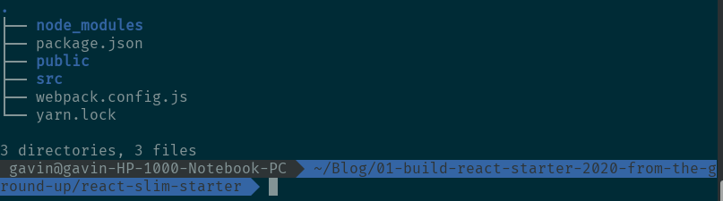

Nowadays, React become the very most popular and powerful javascript library for building UI, surpassing Vue and Angular. I have switched from Angular to React for less than 1 month and was astonished by its flexible JSX syntax and strong render capability.

Angular is a framework for building scalable enterprise-level apps with Typescript while React is focused on building View. At the very beginning, you guys may feel confused about how to configure a React starter for real web development.

Actually, Create-react-app is great and well-designed but is not 100% suitable for your business case. So let’s configure a react starter and really learn a lot from it.

In this article, you will go over the process to use **React**, **Webpack**, **Babel**, **Eslint**, **Prettier** to build a development-ready react starter.

## Prerequisite

## Get Started

### create project folder and package.json

### install webpack & webpack-cli

`yarn add -D webpack webpack-cli`

> Note: without installing webpack-cli, your webpack command will not work

### create src, public, src/index.html, src/main.js, webpack.config.js

as follows:

### let's have a test, and run this app

1. cd src folder, create a module named `Greeter.js`
   
2. import Greeter module, create a node, and append to `

`
   
3. configure webpack in webpack.config.js (in development mode)
   
4. add `"build": "webpack"` to npm scripts in package.json
   
5. `npm run build`, build output will be printed on Terminal console
   

### we should serve this project, not static html

1. `yarn add -D webpack-dev-server`
2. configure in webpack.config.js
   
3. enable HMR as well
4. add `"start:dev": "webpack-dev-server"` to npm script
5. `npm run start:dev`
   
6. **what a mess!** we need silent webpack output by adding `stats: 'minimal'`

before:

after:

### Okay, React is coming

1. `yarn add react react-dom`
2. `yarn add -D @babel/core babel-loader @babel/preset-env @babel/preset-react`
3. configure babel in .babelrc
   
4. use babel-loader
   
5. clear main.js and remove Greeter.js, let's write a React Component
   

### configure eslint

1. `yarn add -D eslint eslint-plugin-import eslint-config-airbnb-base eslint-plugin-react`
2. `./node_modules/.bin/eslint --init` to generate eslint default configuration
3. add `"extends": "airbnb-base"` to .eslintrc
4. add eslint plugin to code editor, for me, sublimeLinter and subimeLinter-eslint

### formate your code with Prettier

1. `yarn add husky lint-staged prettier`
2. add the following fields to your package.json
   
3. `"formate": "./node_modules/.bin/prettier --write 'src/**/*.{js,jsx,ts,tsx,json,css,scss,md}'"` to your package.json
4. add JsPrettier plugin to sublime
5. give your first git commit, and then

source code: https://github.com/cnscorpions/react-slim-starter

Feel free to comment and share your opinion.

### Reference:

1. [Webpack doc](https://webpack.js.org/concepts/)
2. [入门 Webpack，看这篇就够了](https://segmentfault.com/a/1190000006178770)
3. [Tutorial: How to set up React, webpack, and Babel from scratch (2020)](https://www.valentinog.com/blog/babel/)
4. [airbnb eslint configuration](https://github.com/airbnb/javascript/tree/master/packages/eslint-config-airbnb-base)
5. [eslint installation and usage](https://github.com/eslint/eslint#installation-and-usage)
6. [how to run eslint fix from npm script](https://stackoverflow.com/questions/40271230/how-to-run-eslint-fix-from-npm-script)
7. [setting up your editor](https://create-react-app.dev/docs/setting-up-your-editor/)
8. [husky](https://github.com/typicode/husky)
9. [lint-staged](https://github.com/okonet/lint-staged)
